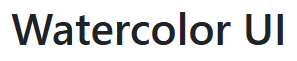

# Watercolor UI

<div align="center">



Modern, minimalist, watercolor-inspired UI components for **Vue 3.5+**, **React 18/19**, and **Next.js (App Router)** — built with **TypeScript**.

[](https://www.npmjs.com/package/@zeturn/watercolor-vue)
[](https://www.npmjs.com/package/@zeturn/watercolor-react)
[](LICENSE)

[🚀 Quick Start](#-quick-start) · [📚 Docs](https://zeturn.github.io/watercolor/) · [🧩 Vue Storybook](https://zeturn.github.io/watercolor/vue/) · [⚛️ React Storybook](https://zeturn.github.io/watercolor/react/) · [📝 Changelog](CHANGELOG.md)

</div>

## ✨ Features

- One design language, three platforms (Vue 3.5+, React 18/19, and Next.js App Router)
- Borderless default Watercolor style with CSS variable theming
- Theme v2 JSON loading through React/Vue providers
- Built-in light, dark, and system mode handling
- TypeScript-first APIs
- Tree-shaking friendly builds
- Optional icon packs (install only what you use)
- LocaleProvider for localizable accessibility strings

## 📚 Documentation

- Docs: https://zeturn.github.io/watercolor/
- Vue Storybook: https://zeturn.github.io/watercolor/vue/
- React Storybook: https://zeturn.github.io/watercolor/react/

## 🚀 Quick Start

### Install

**Vue 3.5+**

```bash
npm install @zeturn/watercolor-vue
```

**React 18 / 19**

```bash
npm install @zeturn/watercolor-react
```

**Next.js (App Router)**

```bash
npm install @zeturn/watercolor-next
```

### Usage

Import styles once in your app entry, then import components as needed.

```ts
// Vue
import '@zeturn/watercolor-vue/style.css'
// React
// import '@zeturn/watercolor-react/style.css'
```

```ts
// Vue
import { Button } from '@zeturn/watercolor-vue'
// React
// import { Button } from '@zeturn/watercolor-react'
// Next.js (App Router — no 'use client' needed, the RSC boundary ships in the package)
// import { Button } from '@zeturn/watercolor-next'
```

### Theme v2

The default Watercolor theme works without configuration. Use `ThemeProvider` for light, dark, and system modes; optionally load a strict Theme v2 JSON for brand tokens.

```tsx
import { ThemeProvider } from '@zeturn/watercolor-react'

<ThemeProvider defaultMode="system" themeUrl="/theme.json">
  <App />
</ThemeProvider>
```

Theme loading safely falls back to the default borderless Watercolor design. See the theming guide for SSR pre-paint helpers and scoped themes.

### Examples

- `examples/react-minimal`
- `examples/vue-minimal`
- `examples/next-ssr`
- `examples/nuxt-ssr`

The examples are version-checked with the docs/examples audit so installation snippets stay aligned with published packages.

### Icons (optional)

The `Icon` component supports multiple libraries through opt-in Watercolor icon
packages. The React and Vue packages do not install any icon pack by default.

- React: `@zeturn/watercolor-icons-lucide-react`, `-heroicons-react`, `-tabler-react`, or `-phosphor-react`
- Vue: `@zeturn/watercolor-icons-lucide-vue`, `-heroicons-vue`, `-tabler-vue`, or `-phosphor-vue`
- Both frameworks can use `@zeturn/watercolor-icons-feather`.

**Example**:
```bash
npm install @zeturn/watercolor-icons-lucide-react
# or: npm install @zeturn/watercolor-icons-lucide-vue
```

## 🤝 Contributing

See [note/组件开发与规范.md](note/%E7%BB%84%E4%BB%B6%E5%BC%80%E5%8F%91%E4%B8%8E%E8%A7%84%E8%8C%83.md) and [note/发布与集成指南.md](note/%E5%8F%91%E5%B8%83%E4%B8%8E%E9%9B%86%E6%88%90%E6%8C%87%E5%8D%97.md).

## 📄 License

ISC — see [LICENSE](LICENSE).
